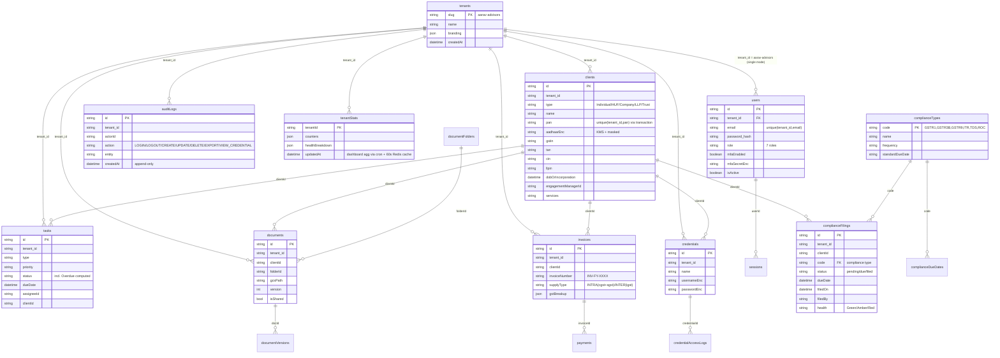

# CAOMS — Firestore ERD (tenant_id on every document)

**Indexes (composite):** `(tenant_id, pan)`, `(tenant_id, gstin)`, `(tenant_id, status, dueDate)`, `(tenant_id, createdAt desc)`.

**Rules:** Every read/write filters `tenant_id == request.auth.token.tenant_id`. `auditLogs` denies update/delete. `single` mode pins `tenant_id`; `multi` resolves from JWT/header. Cross-tenant isolation holds in both.

**Encryption:** `aadhaarEnc`, `usernameEnc`, `passwordEnc` via Secret Manager KMS (dev: base64 stub). Serializers mask `**** + last4`.
